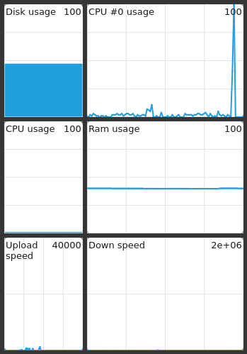

# SWC (Sliding Window Container)
SWC is a window-embedder and a widget container. Its job is to embed windows in a Qt container, so that it can be slided in and out of the screen in a fancy manner.





## Using swc
Syntax is as follow:
```bash
# Create a new container with a chosen swc-id
swc <input option> [options] <swc-id>
# Toggle an existing container (slide in or out)
swc <swc-id>

# Embed htop in a container
swc -b 'urxvt -e htop' swc-top
# Toggle the htop container
swc swc-top
```

### Input options
To create a new swc container, you can either use an existing window as input, create a new process, or manually fill the container with widgets.
- *(TODO)* window-id of an existing window (```-w <WID>```)
- pid of an existing process (```-p <PID>```)
- class-name of an existing window (```-c <className>```)
- *(TODO)* class of an existing window (```--class <class>```) 
- *(TODO)* window name of an existing window (```-n <windowName>```)
- create a process from a binary file. A classname can be given to help the window lookup. (```-b "<binaryFile> [parameters]" [-c <className>]```)
- create a [grid of modules](#Grid-of-modules-widgets) (```-m <gridDescriptor.json>```)

### Other options
- position (```-P x,y```)
- size (```-S {width,height | auto}```)
- interrupt/pause the process when the container is hidden (```-I```)
- sliding direction (```-D u|d|r|l```)


## Configuration file
More options can be adjusted in the configuration file located in *$HOME/.config/swc/swc.conf*. This file is auto-generated by swc and it will contain the default values for all the settings currently supported by this version of swc.

Below are the settings that you can change (or soon can). **These settings are explained in the manpage**.

### Container placement
- position_type and position
- size_type and size
- *(TODO)* immovable

### Container decorations
- *(TODO)* curved corners
- *(TODO)* transparency
- *(TODO)* blur

### Container properties
- *(TODO)* releaseWindowOnExit
- pauseOnHide
- *(TODO)* className
- *(TODO)* neverClose
- hideOnFocusLoss

### Animation properties
- direction
- duration
- *(TODO)* easing
- *(TODO)* displayTime

### Window Hints
- bypassWindowManager
- alwaysOnTop
- alwaysBelow
- frameless


## Grid of modules (widgets)
The swc container can hold widgets (called modules) which are organized in a grid. The columns and rows can have different stretch factors, which are used to automatically determine the dimensions of each cell. The total size of the container is however given by the [Configuration file](#Configuration-file).

The grid is configured thanks to a `grid descriptor` json object. An example of such file is given below. **All details are given in the manpage**.

```json
  {
    "rows": [2,3],
    "columns": [1,2],
    "schemas": [
      {
        "name": "lineGraph",
        "type": "line",
        "points": 100,
        "lineWidth": 5
      }
    ],
    "modules": [
      {
        "schema": "lineGraph",
        "src": {"type": "cpu", "args": [0]},
        "refresh": 1000,
        "row": 0,
        "column": 1,
        "title": "CPU #0 usage"
      },
      {
        "schema": "lineGraph",
        "src": "mem",
        "refresh": 500,
        "row": 1,
        "column": 1,
        "title": "Ram usage"
      }
    ]
  }
```


## Building swc
Make sure you have the following dependencies: *cmake, qt5-base, xdotool, help2man*.

Then you can start the build process:
```bash
git clone git@github.com:gbossu/swc.git
cd swc
mkdir build && cd build
cmake ..
make
```

You can also run ```sudo make install``` if you want to install swc.

## TODO
- Implement all the options
- Better error management
- Add example execution
- Exit gracefully on SIGKILL
- Generate better Doxygen documentation
- Testing
